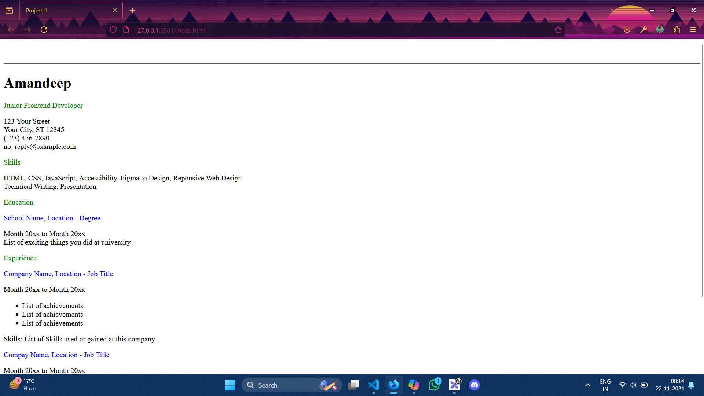

# Front-end Projects from Roadmap.sh

This repository contains front-end projects built following the [roadmap.sh](https://roadmap.sh/) front-end developer path.

## Projects

[Single page CV](https://roadmap.sh/projects/single-page-cv), [Basic HTML Web Site](https://roadmap.sh/projects/basic-html-website)

Click any Img to see code and live demo

  
  <a href = '/Frontend Projects/02-Basic-HTML-Website'>
<!--      -->
  </a>

